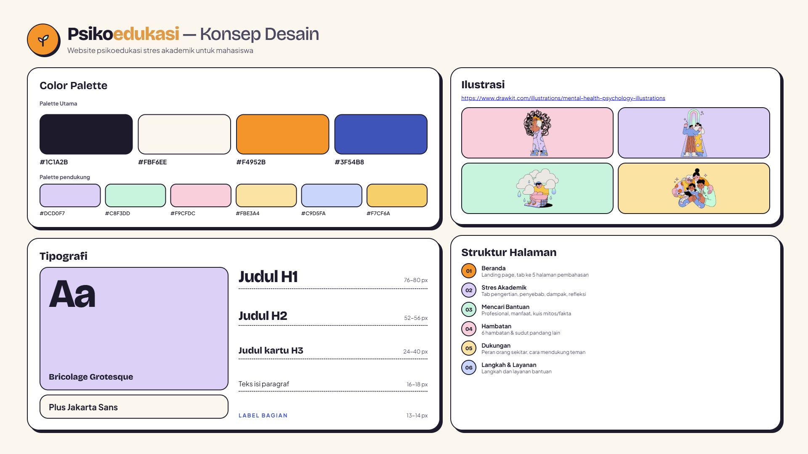

# Psikoedukasi

**Tidak Harus Menghadapi Semuanya Sendiri.**

Psikoedukasi adalah website edukasi untuk mahasiswa tentang **stres akademik** dan **pentingnya mencari bantuan profesional**. Website ini mengajak pengunjung mengenali apa yang sedang mereka alami, memahami hal-hal yang sering membuat ragu untuk meminta bantuan, dan menemukan layanan psikologi yang bisa dihubungi di Makassar dan Sulawesi Selatan.

> Website ini bukan alat diagnosis dan tidak menggantikan konsultasi dengan psikolog atau tenaga profesional.

---

## Tujuan

- Membantu mahasiswa **mengenali stres akademik** sejak awal: pengertian, penyebab, dan dampaknya.
- Menunjukkan bahwa **mencari bantuan adalah langkah berani**, bukan tanda kelemahan.
- Meluruskan **mitos** seputar psikolog dan konseling.
- Memberi **panduan langkah demi langkah** dan **daftar layanan** yang bisa langsung dihubungi.

## Sasaran Pengguna

Mahasiswa yang sedang merasa tertekan oleh tuntutan kuliah, teman atau keluarga yang ingin mendukung, serta siapa pun yang ingin belajar tentang kesehatan mental di lingkungan kampus.

---

## Isi Website

Website terdiri dari enam halaman yang disusun seperti sebuah perjalanan singkat.

| No  | Halaman                                    | Isi utama                                                                                                                                           |
| --- | ------------------------------------------ | --------------------------------------------------------------------------------------------------------------------------------------------------- |
| 01  | **Beranda**                                | Pesan utama, penjelasan singkat, dan peta lima bab materi.                                                                                          |
| 02  | **Mengenali Stres Akademik**               | Pengertian stres akademik, empat faktor penyebab (akademik, pribadi, sosial, lingkungan), dampaknya, refleksi diri, dan ilustrasi "tumpukan beban". |
| 03  | **Mengapa Mencari Bantuan Itu Penting?**   | Pengertian _help-seeking_, perbedaan psikolog, konselor, dan psikiater, enam manfaat bantuan profesional, serta kuis Mitos atau Fakta.              |
| 04  | **Apa yang Membuat Ragu Mencari Bantuan?** | Enam hambatan yang sering dirasakan, masing-masing dengan sudut pandang lain untuk melihatnya.                                                      |
| 05  | **Dukungan dari Orang Sekitar**            | Siapa saja yang bisa mendukung, peran mereka, dan cara mendukung teman yang sedang kesulitan.                                                       |
| 06  | **Mencari Bantuan Itu Bisa Dilakukan**     | Tujuh langkah sederhana mencari bantuan dan daftar enam layanan psikologi beserta kontaknya.                                                        |

## Konsep Website

## Catatan

Informasi di website ini bersifat edukatif. Jika stres mulai mengganggu aktivitas sehari-hari, itu sudah cukup menjadi alasan untuk mencari bantuan dari tenaga profesional.
